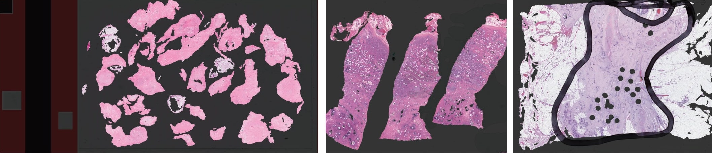
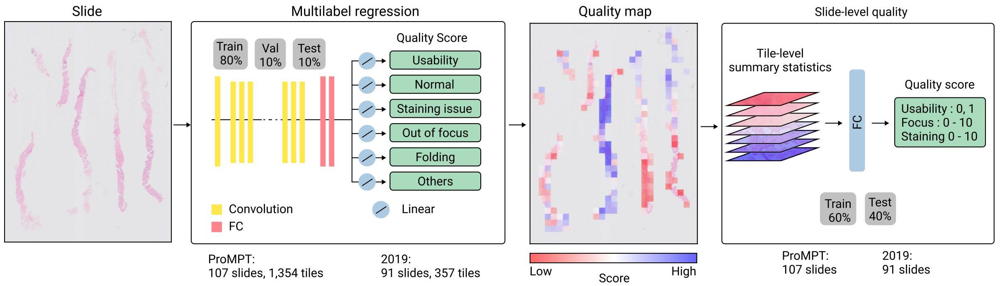

Quality Assessment of Retrospective Histopathology Whole-Slide Image Cohorts
===========
In this study, a quality assessment pipeline is  proposed in which possible multiple artefacts are predicted in a same region along with diagnostic usability of the image. 

***How does it work?** A  multi-task deep neural network is trained to predict if an image tile is usable for diagnosis/research and the  kind of artefacts present in the image tile. Quality overlays are then generated from image tile predictions. Quality overlays are further mapped to a standard  scoring system to predict the usability,  focus and staining quality of whole slide.


###  WSI Tissue Segmentation:


A UNET segmentation model ([download])(https://drive.google.com/file/d/1otWor5WnaJ4W9ynTOF1XS755CsxEa4qj/view?usp=sharing) is trained on multiple tissue types including prostate and colon tissue to separate tissue from background.
The following optional arguments can be used to run the model:

* `--slide_dir`:  path to slide directory
* `--slide_id`:  slide filename (or "*" for all slides)
* `--save_folder`:  path to save results
* `--mask_magnification`:  magnification power of generated tissue masks. It is recommended to use 1.25 or 2.5.
* `--mpp_level0`:  manually enter mpp at level 0 if not available in slide properties as "slide.mpp['MPP']"


###  Tile extraction
**tiling.py** extracts tiles from WSIs passing the following arguments:

* `--slide_dir`:  path to slide directory
* `--slide_id`:  slide filename (or "*" for all slides)
* `--save_folder`:  path to save results
* `--tile_magnification`:  magnification at which tiles are extracted
* `--mask_magnification`:  magnification power of tissue masks
* `--tile_size`:  pixel size of the tiles; the default is 256
* `--stride`:  stride; the default is 256
* `--mask_dir`:  path to save tissue masks 
* `--mask_ratio`:  the minimum acceptable masked area (available tissue) to extract tile
* `--mpp_level0`:  manually enter mpp at level 0 if not available in slide properties as "slide.mpp['MPP']"

### Quality assessment 

A multi-label ResNet18 model ([download](https://drive.google.com/file/d/13egPkDufR6W4aTBUAAf8uV6zQxwdBx6r/view?usp=sharing)) with 6 outputs of linear activation function is trained on image tiles from ProMPT prostate cancer cohort.  
Annotated tiles are  256x256 in size and have been exctracted at 5X magnification. Tiles are further downsampled to 224x224 to accomodate for the model.
The model outputs are:

* `output1`:  predicts the usability of an image, where 1 indicates the image is of appropriate quality for diagnosis.
* `output2`:  predicts if an image looks normal, where 1 indicates no artefact seen.
* `output3`:  predicts if an image is out of focus, where 1 indicates severe, 0.5 slight, and 0 no focus issues.
* `output4`:  predicts if an image has staining issues, where 1 indicates severe, 0.5 slight, and 0 no staining issues.
* `output5`:  predicts if an image has tissue folding, where 1 indicates that tissue folding is present.
* `output6`:  predicts if an any other artefacts such as dirt, glue, ink, cover slip edge, diathermy, bubbles, calcification and tissue scoring is present, where
1 indicates that other artefacts are present.

**Notes**: ProMPT dataset has very limited areas of folded tissue and hence our dataset does not include a various forms of tissue folding in histology.

======
To use the quality assessment tool, run:
**python run.py** by passing the following arguments:
* `--slide_dir`:  path to slides
* `--slide_id`:  slide filename or "*" for going through all slides.
* `--mpp_level0`: manually enter mpp at level 0 if not available in slide properties as "slide.mpp['MPP']"
* `--mask_dir`: path to tissue mask folder (the output folder of tissue segmentation step)
* `--mask_magnification`: the magnification power of tissue masks 
* `--mask_ratio`: the minimum ratio of masked area (tissue) in an image tile to proceed tile processing
* `--save_folder`: folder path to save results. 
Quality overlays are collected in a dictionary and saved as **slide_name.npy** with key values as below:
``` shell 
{'usblty': quality overlay from output1, 'normal': quality overlay from output2, 
'stain_artfcts': quality overlay from output3, 'focus_artfcts': quality overlay from output4, 
'folding_artfcts': quality overlay from output5, 'other_artfcts': quality overlay from output6 
'processed_region': regions that have been processed during quality assessment} 
```
    
**Notes**
- the pixel size of quality overlays is (slide_size_at_5X) / 256:
- each pixel value in the quality overlay represents quality prediction value for a tile of  256*256. 
- quality overlays can be easily regenerated at magnification "X" by: 

`overlay at magnification X = overlay.repeat(X*256/5, axis=0).repeat(X*256/5, axis=1)`

=====

### Mapping quality overlays to standard whole-slide quality scores  
Three separate linear regression models are used to predict WSI usability, focus and staining scores. 
To map the quality overlays to standard slide-level scores, run:
**python predict_slide_scores.py** by passing the following arguments:
* `--quality_overlays_dir`:  path to quality overlays folder
* `--add_mask`:  add another mask (e.g. tumor mask) on top of tissue mask
* `--slide_scores_filename`:  csv filename to save standard scores for each slide
